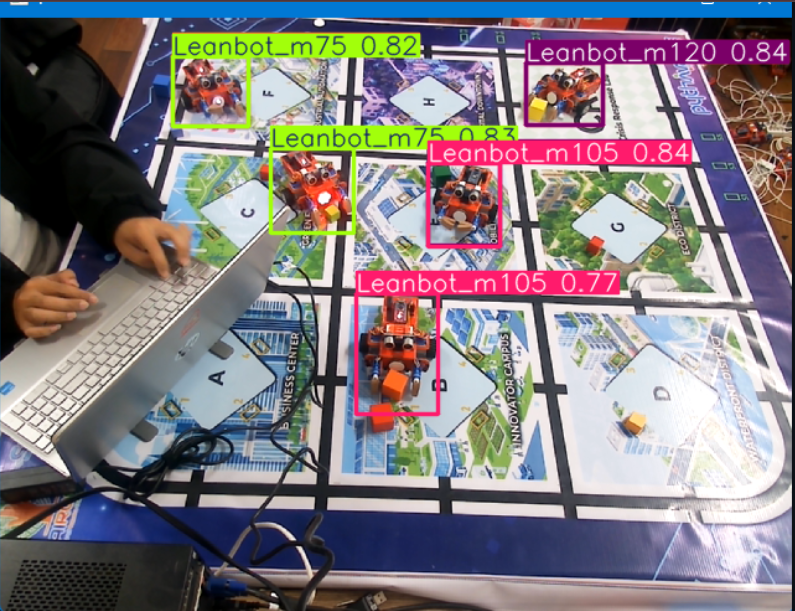
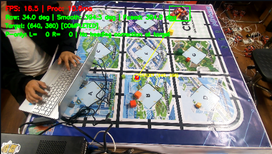
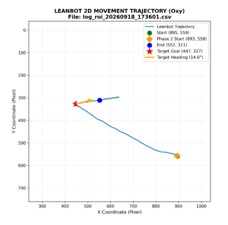
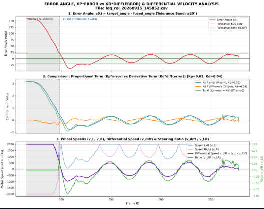

# Báo cáo tiến độ nghiên cứu ngày 09/10/2026

**Đề tài ( tên dự kiến):** Ước lượng góc định hướng 0-360° của robot Leanbot từ camera cố định bằng CNN-based Object Detection.
## A. Tổng quan dự án
- Hiện tại dự án em nghiên cứu và thực hiện trên Công Ty DTT do Thầy Quảng hướng dẫn trực tiếp đã hoàn thành và giải quyết một số nội dung bài toán nhưu sau ạ : 

1. **Bài toán:** 
    - Nhận diện, phát hiện vị trí và ước lượng góc định hướng của robot Leanbot trên mặt phẳng 2D bằng một camera cố định ( đặt chéo 45 độ ở một phía sa bàn) 
    - Thông qua vị trí và góc định hướng ,hệ thống máy chủ sẽ điều hướng Leanbot tới vị trí yêu cầu trên sa bàn thôgn qua hình ảnh từ Camera. 

2. **Mục tiêu:**
    - Ước lượng hướng quay từ 0-360°, phân biệt góc dương/âm mà không cần dùng mô hình các mô hình keypoint pose estimation cần dữ liệu huấn luyện và quy trình thu thập dữ liệu phức tạp
    - Áp dụng bộ điều khiển PID tính toán lệnh điều khiển, gửi lệnh điều khiển thôgn qua BLE để Leanbot di chuyển tới vị trí yêu cầu

    - Ảnh ví dụ minh họa khi nhận diện góc Leanbot (Leanbot_m75 nghĩa là minus 75 degree : -75 độ):

    

    - Ảnh thực tế triển khai khi điều khiển : 

    

    - Ảnh đường quỹ đạo di chuyển : 

    

    - Ảnh đồ thị các dữ liệu quan sát : 

    
3. **Một số kết quả kỹ thuật bước đầu:**
    - Đã xây dựng được mô hình phát hiện Leanbot và ước lượng góc định hướng bao phủ toàn bộ 360°, bao gồm các góc có dấu trong bốn góc phần tư đường tròn lượng giác. 
    - Bộ dữ liệu của phiên bản huấn luyện ngày gần nhất ( 11/09/2026) gồm 204 ảnh, 24 lớp góc 
    - Đã triển khai phương pháp kết hợp Soft Angular BCE và Weighted Circular Mean nhằm khai thác quan hệ tuần hoàn giữa các lớp góc, từ đó suy ra góc liên tục.
    - Đã tích hợp mô hình vào hệ thống nhận diện, theo dõi và điều khiển chuyển động của Leanbot bằng PID controller với camera cố định.

## B. Nội dung trọng tâm và kết quả hiện tại

1. **Hệ thống thu thập dữ liệu huấn luyện (dataset):** Đã triển khai bộ công cụ, quy trình thu thập ảnh, tách nền và tự động tạo nhãn bounding box
2. **Huấn luyện mô hình:** Sử dụng **YOLO11n** và triển khai chỉnh sửa hàm Loss function thành **Soft Angular BCE** nhằm xét đến tính tuần hoàn và liên hệ giữa các class góc. 
3. **Suy ra góc liên tục:** Dùng **weighted circular mean** trên điểm dự đoán (confidence) của các lớp góc để tính toán ra góc (có dấu) trong miền [−180°, 180°].
4. **Triển khai inference thực nghiệm :** Đã triển khai, export sang mô hình dạng **OpenVINO FP16** với 2 chế độ **Full Detection 640×640** và **ROI Tracking 160×160**, có cơ chế chuyển về tìm kiếm toàn ảnh nếu không phát hiện được Leanbot. 

- Theo như gợi ý của Thầy hôm qua thì em chia dự án thành các nội dung chính có thể đào sâu để viết bài publication như sau ạ : 

### 1. Phương pháp xác định góc xuay của vật thể từ camera cố định ứng dụng mô hình Yolo detection 
- **Điểm đóng góp chính** : 
    - Đưa ra công thức tính hàm mất mát (Loss function) cho bài toán : Soft Angular BCE Loss . 
        - Mục đích thay thế BCE (Binary Cross Entropy loss) mặc định của YOLO model , vốn chỉ xem mỗi nhãn là độc lập, khôgn có mối quan hệ gì với nhau ( ví dụ Leanbot 0 độ và Leanbot 15 độ được xem là độc lập hoàn toàn không có sự tương đồng nào gần nhau)
        - Tuy nhiên với bài toán xác định góc thì các nhãn có mối quan hệ với nhau ( ví dụ Leanbot 0 độ, nhìn gần giống với Leanbot 15 độ) 
        - Từ các mối quan hệ mờ này ta có thể ước lượng được góc giữa các nhãn gần nhau thông qua cơ chế cộng vector Confidence ( trọng số dự đoán ) của các nhãn. 
- Phân tích dữ liệu raw của model Yolo trước khi đi qua lớp lọc NMS ( lớp lọc giữ lại dự đoán có confidence cao nhất ) :
    - Dữ liệu trước lớp NMS là dữ liệu thô output trực tiếp từ model, nó chứa toàn bộ trọng số dự đoán của các class góc của Leanbot. Thôgn qua dữ liệu này để tính toán vector tổng hợp trọng số confidence để tính toán ra góc ước lượng 
- **Điểm đóng góp bổ sung ( thực nghiệm)** : 
    - Cơ chế thu thập dữ liệu ; đánh nhãn tự động và tự động tạo dataset cho mô hình huấn luyện 
    - Các cơ chế làm mịn dữ liệu thô bị nhiễu sau khi ước lượng góc được áp dụng để tăng ổn định và độ chính xác output: 
        - **Temporal Angle Smoothing**: Làm mượt chuỗi góc dự đoán theo thời gian bằng cách unwrap góc và hồi quy đa thức bậc nhất trên cửa sổ dữ liệu trượt, hạn chế dao động giữa các frame.
        - **Trajectory-based Heading Estimation**: Ước lượng hướng chuyển động dựa trên quỹ đạo tọa độ tâm robot ((x,y)) quan sát được qua nhiều frame.
        - **Velocity-Adaptive Angle Fusion**: Kết hợp góc từ mô hình CNN và hướng quỹ đạo với trọng số thay đổi theo vận tốc chuyển động : Khi robot gần đứng yên, ưu tiên góc CNN model detect ; khi robot chuyển động rõ ràng, tăng trọng số của hướng quỹ đạo.

#### Kết quả khảo sát sơ bộ — 5 công trình liên quan nhất đến CNN/YOLO và ước lượng góc tuần hoàn

**Tiêu chí lựa chọn:** Ưu tiên (i) xử lý tính tuần hoàn của góc, (ii) phân lớp góc có nhãn mềm kết hợp object detection, (iii) khả năng dự đoán **heading có hướng 360°**, và (iv) giá trị làm baseline cho dự án Leanbot. Danh sách gồm **3 công trình nền tảng/đối chứng trực tiếp** và **2 công trình bổ sung về triển khai/cải tiến**; không chọn theo năm công bố đơn thuần.

> **Phân biệt bài toán:** CSL/YOLO-CSL/adaptive angle classification chủ yếu dự đoán góc của *rotated bounding box* (OBB, có thể chỉ quy ước trong 90°/180°). Leanbot cần **directed heading 360°**, phân biệt đầu và đuôi robot. Vì thế **mAP OBB không thể so trực tiếp với circular MAE của Leanbot**. \"Chưa giải quyết\" bên dưới chỉ nói về phạm vi/thí nghiệm được công bố, **không mặc nhiên chứng minh research gap chưa từng được nghiên cứu**.
>
> **Xếp hạng:** SJR và JCR là hai chuẩn **khác nhau**, thay đổi theo năm và *subject category*. Dùng mốc **2025** (năm xếp hạng, không phải năm xuất bản bài báo); số liệu quartile lấy từ khảo sát trước, cần đối chiếu nguồn chính thức khi sử dụng trong bài báo.

##### 1. Arbitrary-Oriented Object Detection with Circular Smooth Label — ECCV 2020

- **Thông tin bài báo:** Xue Yang, Junchi Yan; *European Conference on Computer Vision (ECCV 2020)*, LNCS 12353, tr. 677–694. Hội nghị, **không áp dụng Q tạp chí SJR/JCR**. [Trang công bố](https://www.ecva.net/papers/eccv_2020/papers_ECCV/html/666_ECCV_2020_paper.php) · [DOI](https://doi.org/10.1007/978-3-030-58598-3_40).
- **Bài toán và phương pháp:** Xử lý sự gián đoạn khi hồi quy góc OBB qua biên chu kỳ: thay angle regression bằng **angle classification**, thêm **Circular Smooth Label (CSL)** để các lớp góc lân cận có nhãn mềm tuần hoàn; khảo sát hàm cửa sổ (bao gồm Gaussian) và độ rộng cửa sổ.
- **Kết quả/đối chứng:** Đánh giá các detector/biểu diễn góc, ảnh hưởng window và radius trên **DOTA, HRSC2016, ICDAR2015, MLT**; chứng minh khả năng khắc phục lỗi biên trong rotated detection. Không báo cáo trực tiếp sai số directed heading 360° cho robot.
- **So với Leanbot:** **Có:** lớp góc rời rạc, khoảng cách góc tuần hoàn, Gaussian soft targets — rất gần **Soft Angular BCE**. **Chưa có trong bài:** 24 class biểu diễn hướng đầu–đuôi robot 360°, tổng hợp raw class scores trước NMS để suy ra góc liên tục, và thí nghiệm vài trăm ảnh.
- **Vai trò khi viết báo:** **Bắt buộc trích dẫn (prior work) + baseline loss:** đối chiếu **YOLO11n hard BCE** với **circular soft-label BCE/CSL** trên cùng bộ ảnh Leanbot. **Không được tuyên bố Gaussian circular soft labels là phát minh hoàn toàn mới.**

##### 2. Detection of Objects in Satellite and Aerial Imagery Using Channel and Spatially Attentive YOLO-CSL for Surveillance — 2024

- **Thông tin bài báo:** Divyansh Chaurasia, B. D. K. Patro; *Image and Vision Computing*, **147**, 105070 (2024). **SJR 2025: Q1 (Computer Vision and Pattern Recognition); JCR 2025: Q2 (Computer Science, Artificial Intelligence), Q1 (Computer Science, Software Engineering)** theo ngành. [Nhà xuất bản](https://www.sciencedirect.com/science/article/pii/S0262885624001744) · [DOI](https://doi.org/10.1016/j.imavis.2024.105070).
- **Bài toán và phương pháp:** Phát hiện vật thể quay trong ảnh viễn thám; tích hợp **YOLOv5 + nhánh dự đoán góc riêng**, **Circular Smooth Labels + BCEWithLogits** và channel/spatial attention.
- **Kết quả/đối chứng:** Tác giả báo cáo **mAP 57,86 trên DOTA-v2**, cao hơn phương pháp đứng thứ hai trong bảng so sánh **0,20 điểm mAP**; mô hình khoảng **25 triệu tham số, 54 GFLOPs**. Đây là mAP detection OBB, không phải sai số heading.
- **So với Leanbot:** **Có:** YOLO + phân loại góc + nhãn mềm tuần hoàn + BCE — **rất gần thiết kế thuật toán**. **Khác:** dùng *angle branch* riêng cho OBB, còn Leanbot mã hóa 24 hướng đầu robot thành detection classes và dùng **weighted circular mean** trên scores; không đánh giá bài toán tracking/heading robot 360°.
- **Vai trò khi viết báo:** **Ưu tiên trích dẫn rất cao (prior work sát nhất về YOLO + CSL + BCE)**. Có thể thiết kế **baseline YOLO + angle branch** hoặc, tối thiểu, đối chứng nhãn cứng/nhãn mềm trong cùng YOLO11n. Không so mAP DOTA-v2 với circular MAE Leanbot.

##### 3. Biternion Nets: Continuous Head Pose Regression from Discrete Training Labels — GCPR 2015

- **Thông tin bài báo:** Lucas Beyer, Alexander Hermans, Bastian Leibe; *German Conference on Pattern Recognition (GCPR 2015)*, LNCS 9358, tr. 157–168. Hội nghị, **không áp dụng Q tạp chí SJR/JCR**. [Trang tác giả và mã nguồn](https://www.vision.rwth-aachen.de/publication/0021/) · [DOI](https://doi.org/10.1007/978-3-319-24947-6_13).
- **Bài toán và phương pháp:** Dự đoán **góc hướng liên tục 360°** khi nhãn training chỉ là các góc thô/rời rạc, tránh gián đoạn tại 0°/360°; CNN hồi quy trực tiếp **biternion \((\cos\theta,\sin\theta)\)** thay vì chia góc thành nhiều classes.
- **Kết quả/đối chứng:** So sánh các mô hình hồi quy/phân loại trên nhiều bộ dữ liệu hướng đầu; báo cáo hiệu quả của biternion từ coarse labels. **Chưa đưa số MAE vì cần đọc đúng bảng và cách chia tập trong bài gốc**.
- **So với Leanbot:** **Có:** directed orientation 360°, nhãn góc thưa, đầu ra liên tục, không đòi gán nhãn keypoint. **Khác:** không phải detector YOLO tích hợp class heading và không dùng Soft Angular BCE, pre-NMS scores hay vòng điều khiển Leanbot.
- **Vai trò khi viết báo:** **Baseline ước lượng góc bắt buộc:** huấn luyện **CNN/YOLO ROI backbone + sin/cos head** trên **cùng train/test split** với 24-class Soft Angular BCE; so **circular MAE, lỗi vùng biên 0°/360°, chi phí dữ liệu**. Đây là so sánh có ý nghĩa khoa học hơn trích riêng mAP OBB.

##### 4. A Deep Learning Framework for Accurate Vehicle Yaw Angle Estimation from a Monocular Camera Based on Part Arrangement — 2022

- **Thông tin bài báo:** Wenjun Huang và cộng sự; *Sensors*, **22(20)**, 8027 (2022). **SJR 2025: Q1 (Instrumentation); JCR 2025: Q2 (Instruments & Instrumentation)** theo ngành. [Bài báo mở](https://www.mdpi.com/1424-8220/22/20/8027) · [DOI](https://doi.org/10.3390/s22208027).
- **Bài toán và phương pháp:** Ước lượng **yaw của xe có hướng** từ một camera RGB; mạng **YAEN** gồm bộ mã hóa sắp xếp bộ phận xe (đầu/đuôi, đèn, gương...) và CNN decoder để dự đoán yaw. Không phụ thuộc rotated-box angle classification.
- **Kết quả/đối chứng:** Trên dữ liệu thực đo của tác giả, **sai số trung bình dưới 3,1°**, **96,45% dự đoán có sai số dưới 10°**, **97 FPS trên RTX 2070 Super**; kết quả có điều kiện về quan sát/bị che khuất và không tái sử dụng trực tiếp cho Leanbot.
- **So với Leanbot:** **Có:** bài toán heading/yaw trực tiếp, monocular camera, mô hình CNN gọn, đánh giá sai số góc thực. **Khác:** cần thông tin/học các **bộ phận xe** thay vì nhãn bbox+góc robot; dữ liệu/thành phần hình học khác, không khai thác 24 class scores và weighted circular mean.
- **Vai trò khi viết báo:** **Trích dẫn cao — Related Work heading bằng monocular CNN, tham khảo cách thu ground truth và thước đo sai số**. Baseline part-based là **tùy chọn** nếu Leanbot có đặc trưng đầu–đuôi đủ rõ; không bắt buộc tái hiện toàn bộ YAEN.

##### 5. Rotated Object Detection Using Adaptive Angle Classification and Dynamic Sample Matching — 2026

- **Thông tin bài báo:** Liu Han, Zhou Peng, Yan Han; *Chinese Journal of Engineering*, **48(3)**, 586–598 (2026). **SJR 2025: Q2 (Engineering); JCR 2025: chưa xác nhận được JIF quartile**. [Nhà xuất bản](https://cje.ustb.edu.cn/en/article/doi/10.13374/j.issn2095-9389.2025.06.09.006) · [DOI](https://doi.org/10.13374/j.issn2095-9389.2025.06.09.006).
- **Bài toán và phương pháp:** Đối tượng quay trong viễn thám/ký tự công nghiệp; cải tiến YOLOv8 bằng **shape-aware adaptive angle classification (SA-ASL)** với **circular Gaussian window có độ rộng phụ thuộc hình dạng đối tượng** và progressive dynamic matching (hIoU → rIoU).
- **Kết quả/đối chứng:** **mAP 78,6% trên DOTA**, **92,4% trên tập ký tự công nghiệp**; ablation báo cáo tăng **4,3% ở nhóm lớp nhạy với góc** nhờ angle classification thích nghi (theo tác giả). Không phải thí nghiệm directed heading 360°.
- **So với Leanbot:** **Có:** nhãn mềm Gaussian tuần hoàn, YOLO, quan tâm độ bất định theo góc. **Khác:** độ rộng nhãn **thích nghi** theo tỷ lệ box thay vì \(\sigma=15^\circ\) cố định; giải góc OBB và ghép mẫu rIoU, không xử lý class heading và circular-mean scores như Leanbot.
- **Vai trò khi viết báo:** **Trích dẫn cao — prior work mới (2026) + gợi ý ablation**: thử \(\sigma\) cố định so với thay đổi; cân nhắc uncertainty-aware target. **Không nên sao chép shape-adaptive σ nếu chưa có giả thuyết phù hợp**, vì kích thước/độ vuông bbox của Leanbot có thể không phản ánh bất định heading.

**Kết luận khảo sát:** (1) CSL đã giải quyết **tính tuần hoàn của các lớp góc**; (2) YOLO-CSL chứng minh **YOLO + CSL + BCE không phải mới**; (3) Biternion chứng minh có thể **ước lượng góc liên tục 360° từ nhãn thưa**; (4) YAEN là prior work trực tiếp về **camera monocular + yaw có hướng**; (5) nghiên cứu năm 2026 cho thấy circular soft labels vẫn được cải tiến (adaptive widths). **Chưa đủ cơ sở khẳng định pipeline Leanbot tối ưu hoặc có novelty chỉ nhờ kết hợp các kỹ thuật trên.**

**Benchmark ngắn hạn nên làm:** Giữ cùng bộ dữ liệu Leanbot với ground truth góc độc lập và tách train/test theo session: **(A)** YOLO11n + hard-label BCE + argmax; **(B)** YOLO11n + Soft Angular BCE + argmax; **(C)** YOLO11n + Soft Angular BCE + weighted circular mean; **(D)** sin/cos regression (Biternion baseline). Báo cáo **circular MAE**, lỗi tại biên 0°/360°, latency; thêm ablation \(\sigma\) khi có kết quả nền. Không so trực tiếp chỉ số từ các bộ dữ liệu/phần cứng khác nhau.

### 2. Toàn bộ hệ thống của bài toán (tính ứng dụng)
- Tối ưu bài toán cho hệ thống máy chủ tính toán yếu : 
    - Tối giản mô hình : YYOLO11n quantization FP16 , OPenvino runtime ,....
    - Cơ chế tracking và ROI ( Region Of Interest) : Giúp giảm kích thước ảnh đầu vào khi thực hiện inference , chỉ tập trugn nhận diện và phân tích gócLeanbot trong vùng quan tâm tracking theo Leanbot để tăng tốc độ xử lý.  
- Hệ thống robot di động Leanbot điều hướng thông qua camera cố định : 
    - Ước lượng được góc Leanbot đang nhìn thấy 
    - Sử dụng PID điều khiển Leanbot ( có thể sử dụng bộ điều khiển khác và so sánh với PID để đối chứng nếu lựa chọn bộ điều khiển khác .)
    - Hệ thống giao tiếp, điều khiển thôgn qua BLE communication với thiết bị chấp hành ( Leanbot )

## C. Khó khăn
- Không
## D. Công việc tiếp theo
- Khảo sát sâu thêm về các bài báo liên quan tới nội dung Orientation Estimation base-on CNN Architecture 
- Chạy lại thực nghiệm và thu thập dữ liệu với góc quay xác thực để lấy kết quả đánh giá, so sánh với các bài báo đã khảo sát 
- Em xin phép nhận thêm ý kiến , đề xuất hướng đi tiếp theo ạ .